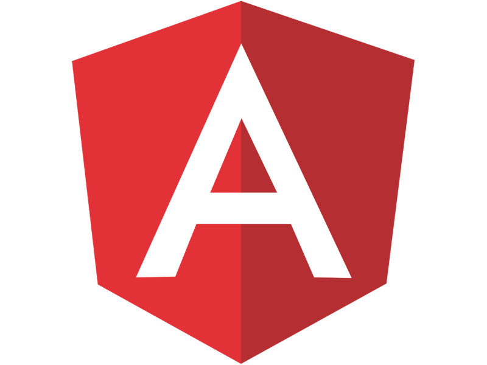

# INTERVIEW TOPICS, QUESTIONS & DISCUSSIONS
  
  

# INTRODUCTION

This repository serves as a knowledge base exploring technical interview questions related to topics and concepts
within computer science, as well as Java specific discussions. There exist many great resources on technical interview questions (linked below), but I wanted to be able to compile a list of questions specific to my own experiences that would be relevant to a junior role.

# TABLE OF CONTENTS
1. [Java & OOP](https://github.com/M-Croghan/Interview-Prep#-java--oop-)
2. [Computer Science Concepts](https://github.com/M-Croghan/Interview-Prep#-computer-science-concepts-)
3. [SQL & Databases / Data Management](https://github.com/M-Croghan/Interview-Prep#-sql--databases-)
4. [HTML / CSS](https://github.com/M-Croghan/Interview-Prep#-html--css-)
5. [JavaScript](https://github.com/M-Croghan/Interview-Prep#-javascript-)
6. [Spring Framework](https://github.com/M-Croghan/Interview-Prep#-spring-framework-)
7. [Git](https://github.com/M-Croghan/Interview-Prep#-git-)
8. [Angular](https://github.com/M-Croghan/Interview-Prep#-angular-)
9. [Python](https://github.com/M-Croghan/Interview-Prep#-python-)
10. [AWS](https://github.com/M-Croghan/Interview-Prep#-aws-)
11. [Linux](https://github.com/M-Croghan/Interview-Prep#-linux-)
12. [Reading List](https://github.com/M-Croghan/Interview-Prep#reading--book-list)
13. [Resources](https://github.com/M-Croghan/Interview-Prep#links--resources)

##  JAVA / OOP 
:ballot_box_with_check: [What are the 4 pillars of Object-Oriented Programming? Describe them:](https://github.com/M-Croghan/Interview-Prep/blob/main/Java_OOP.md#coffee-what-are-the-4-pillars-of-object-oriented-programming-describe-them)  
:ballot_box_with_check: [What is a class?](https://github.com/M-Croghan/Interview-Prep/blob/main/Java_OOP.md#coffee-what-is-a-class)  
:ballot_box_with_check: [What is an object?](https://github.com/M-Croghan/Interview-Prep/blob/main/Java_OOP.md#coffee-what-is-an-object)  
:ballot_box_with_check: [Discuss some of Java's naming conventions](https://github.com/M-Croghan/Interview-Prep/blob/main/Java_OOP.md#coffee-discuss-some-of-javas-naming-conventions)  
:ballot_box_with_check: [Explain the difference between an object & a class](https://github.com/M-Croghan/Interview-Prep/blob/main/Java_OOP.md#coffee-explain-the-difference-between-an-object--a-class)  
:ballot_box_with_check: [Explain the difference between method _overloading_ vs method _overriding_](https://github.com/M-Croghan/Interview-Prep/blob/main/Java_OOP.md#coffee-explain-the-difference-between-method-overloading-vs-method-overriding)  
:ballot_box_with_check: [What is a ***constructor***?](https://github.com/M-Croghan/Interview-Prep/blob/main/Java_OOP.md#coffee-what-is-a-constructor)  
:ballot_box_with_check: [Where are objects / variables stored?](https://github.com/M-Croghan/Interview-Prep/blob/main/Java_OOP.md#coffee-where-are-objects--variables-stored)  
:ballot_box_with_check: [What are some benefits / features of Java?](https://github.com/M-Croghan/Interview-Prep/blob/main/Java_OOP.md#coffee-what-are-some-of-the-benefits--features-of-java)  
:ballot_box_with_check: [Discuss Exception Handling](https://github.com/M-Croghan/Interview-Prep/blob/main/Java_OOP.md#coffee-discuss-exception-handling-errors-vs-exceptions)  
:ballot_box_with_check: [Discuss Abstract Classes](https://github.com/M-Croghan/Interview-Prep/blob/main/Java_OOP.md#coffee-discuss-abstract-classes)  
:ballot_box_with_check: [Discuss Interfaces](https://github.com/M-Croghan/Interview-Prep/blob/main/Java_OOP.md#coffee-discuss-interfaces)  
:ballot_box_with_check: [Can you achieve multiple inheritance in Java](https://github.com/M-Croghan/Interview-Prep/blob/main/Java_OOP.md#coffee-can-you-achieve-multiple-inheritance-in-java)  
:ballot_box_with_check: [Using an abstract class vs. an interface](https://github.com/M-Croghan/Interview-Prep/blob/main/Java_OOP.md#coffee-using-an-abstract-class-vs-an-interface)  
:ballot_box_with_check: [Prove: Everything in Java is an object](https://github.com/M-Croghan/Interview-Prep/blob/main/Java_OOP.md#coffee-prove-everything-in-java-is-an-object)  
:ballot_box_with_check: [Difference between constructor vs. method?](https://github.com/M-Croghan/Interview-Prep/blob/main/Java_OOP.md#coffee-difference-between-constructor-vs-method)  
:ballot_box_with_check: [Give an example of ***checked*** vs. ***unchecked*** exceptions](https://github.com/M-Croghan/Interview-Prep/blob/main/Java_OOP.md#coffee-give-an-example-of-checked-vs-unchecked-exceptions)  
:ballot_box_with_check: [Final vs. Finally vs. Finalize](https://github.com/M-Croghan/Interview-Prep/blob/main/Java_OOP.md#coffee-final-vs-finally-vs-finalize)  
:ballot_box_with_check: [Discuss these access modifiers: Public / Private / Protected / Default](https://github.com/M-Croghan/Interview-Prep/blob/main/Java_OOP.md#coffee-discuss-these-access-modifiers-public--private--protected--default)  
:ballot_box_with_check: [How are Java & JavaScript Different](https://github.com/M-Croghan/Interview-Prep/blob/main/Java_OOP.md#coffee-how-are-java--javascript-different)  
:ballot_box_with_check: [Discuss the difference between _class_, _instance_, & _local_ variables](https://github.com/M-Croghan/Interview-Prep/blob/main/Java_OOP.md#coffee-discuss-the-difference-between-class--instance-variables--methods)  
:ballot_box_with_check: [Discuss Multithreading](https://github.com/M-Croghan/Interview-Prep/blob/main/Java_OOP.md#coffee-discuss-multithreading)  
:ballot_box_with_check: [What is Synchronization?](https://github.com/M-Croghan/Interview-Prep/blob/main/Java_OOP.md#coffee-what-is-synchronization)  
:ballot_box_with_check: [Discuss Mutable Objects](https://github.com/M-Croghan/Interview-Prep/blob/main/Java_OOP.md#coffee-discuss-mutable-objects)  
:ballot_box_with_check: [StringBuffer vs. StringBuilder](https://github.com/M-Croghan/Interview-Prep/blob/main/Java_OOP.md#coffee-stringbuffer-vs-stringbuilder)  
:ballot_box_with_check: [Explain Overriding](https://github.com/M-Croghan/Interview-Prep/blob/main/Java_OOP.md#coffee-explain-overriding)  
:ballot_box_with_check: [What is a Stream? What qualifies one?](https://github.com/M-Croghan/Interview-Prep/blob/main/Java_OOP.md#coffee-what-is-a-stream-what-qualifies-as-one)  
:ballot_box_with_check: [How would you order the filtering & sorting of a stream?](https://github.com/M-Croghan/Interview-Prep/blob/main/Java_OOP.md#coffee-how-would-you-order-the-filtering--sorting-of-a-stream)  
:ballot_box_with_check: [What is the Optional Class?](https://github.com/M-Croghan/Interview-Prep/blob/main/Java_OOP.md#coffee-what-is-the-optional-class)  
:ballot_box_with_check: [What is the JIT Compiler?](https://github.com/M-Croghan/Interview-Prep/blob/main/Java_OOP.md#coffee-what-is-the-jit-compiler)  
:ballot_box_with_check: [What is the difference in checking equality with .equals() vs. '=='?](https://github.com/M-Croghan/Interview-Prep/blob/main/Java_OOP.md#coffee-what-is-the-difference-in-checking-equality-with-equals-vs-)  
:ballot_box_with_check: [Can Static Methods be Overridden or Overloaded?](https://github.com/M-Croghan/Interview-Prep/blob/main/Java_OOP.md#coffee-can-static-methods-be-overridden-or-overloaded)  
:ballot_box_with_check: [What is the point of garbage collection & what area of memory does it address?](https://github.com/M-Croghan/Interview-Prep/blob/main/Java_OOP.md#coffee-what-is-the-point-of-garbage-collection--what-area-of-memory-does-it-address)  
:ballot_box_with_check: [Does Java Operate: "Pass by Reference" or "Pass by Value"?](https://github.com/M-Croghan/Interview-Prep/blob/main/Java_OOP.md#coffee-does-java-operate-pass-by-reference-or-pass-by-value)  
:ballot_box_with_check: [What happens if there is no static modifier in the main method signature in Java?](https://github.com/M-Croghan/Interview-Prep/blob/main/Java_OOP.md#coffee-what-happens-if-there-is-no-static-modifier-in-the-main-method-signature-in-java)  
:ballot_box_with_check: [What happens if there are multiple main methods inside one class in Java?](https://github.com/M-Croghan/Interview-Prep/blob/main/Java_OOP.md#coffee-what-happens-if-there-are-multiple-main-methods-inside-one-class-in-java)  
:ballot_box_with_check: [How does an exception propagate in the code?](https://github.com/M-Croghan/Interview-Prep/blob/main/Java_OOP.md#coffee-how-does-an-exception-propagate-in-the-code)  
:ballot_box_with_check: [Is it mandatory for a catch block to be followed after a try block?](https://github.com/M-Croghan/Interview-Prep/blob/main/Java_OOP.md#coffee-is-it-mandatory-for-a-catch-block-to-be-followed-after-a-try-block)  
:ballot_box_with_check: [Can you call a constructor of a class inside the another constructor?](https://github.com/M-Croghan/Interview-Prep/blob/main/Java_OOP.md#coffee-can-you-call-a-constructor-of-a-class-inside-the-another-constructor)  
:ballot_box_with_check: [Difference between ArrayList and LinkedList in Java?](https://github.com/M-Croghan/Interview-Prep/blob/main/Java_OOP.md#coffee-difference-between-arraylist-and-linkedlist-in-java)  
:ballot_box_with_check: [Difference between HashMap and Hashtable in Java?](https://github.com/M-Croghan/Interview-Prep/blob/main/Java_OOP.md#coffee-difference-between-hashmap-and-hashtable-in-java)  
:ballot_box_with_check: [Difference between TreeSet and TreeMap in Java?](https://github.com/M-Croghan/Interview-Prep/blob/main/Java_OOP.md#coffee-difference-between-treeset-and-treemap-in-java)  
:ballot_box_with_check: [Can we have a return statement in the finally clause? What will happen?](https://github.com/M-Croghan/Interview-Prep/blob/main/Java_OOP.md#coffee-can-we-have-a-return-statement-in-the-finally-clause-what-will-happen)  
:ballot_box_with_check: [What is: Composition, Association, Aggregation?](https://github.com/M-Croghan/Interview-Prep/blob/main/Java_OOP.md#coffee-what-is-composition-association-aggregation)  
:ballot_box_with_check: [What is the JVM?](https://github.com/M-Croghan/Interview-Prep/blob/main/Java_OOP.md#coffee-what-is-the-jvm)  
:ballot_box_with_check: [Why is Java called the Platform Independent Programming Language?](https://github.com/M-Croghan/Interview-Prep/blob/main/Java_OOP.md#coffee-why-is-java-called-the-platform-independent-programming-language)  
:ballot_box_with_check: [What is the Difference between JDK and JRE?](https://github.com/M-Croghan/Interview-Prep/blob/main/Java_OOP.md#coffee-what-is-the-difference-between-jdk-and-jre)  
:ballot_box_with_check: [What are wrapper classes?](https://github.com/M-Croghan/Interview-Prep/blob/main/Java_OOP.md#coffee-what-are-wrapper-classes)   

##  COMPUTER SCIENCE CONCEPTS 
:ballot_box_with_check: [Discuss the difference between _compiled_ & _interpreted_ languages:](https://github.com/M-Croghan/Interview-Prep/blob/main/CS_Concepts.md#computer-discuss-the-difference-between-compiled--interpreted-languages)  
:ballot_box_with_check: [Explain "IS-A" & "HAS-A" relationships](https://github.com/M-Croghan/Interview-Prep/blob/main/CS_Concepts.md#computer-explain-is-a--has-a-relationships)  
:ballot_box_with_check: [List the 4 main pillars of OOP](https://github.com/M-Croghan/Interview-Prep/blob/main/CS_Concepts.md#computer-list-the-4-main-pillars-of-oop)  
:ballot_box_with_check: [What is polymorphism?](https://github.com/M-Croghan/Interview-Prep/blob/main/CS_Concepts.md#computer-what-is-polymorphism)  
:ballot_box_with_check: [What is abstraction?](https://github.com/M-Croghan/Interview-Prep/blob/main/CS_Concepts.md#computer-what-is-abstraction)  
:ballot_box_with_check: [What is inheritance?](https://github.com/M-Croghan/Interview-Prep/blob/main/CS_Concepts.md#computer-what-is-inheritance)  
:ballot_box_with_check: [What is encapsulation?](https://github.com/M-Croghan/Interview-Prep/blob/main/CS_Concepts.md#computer-what-is-encapsulation)  
:ballot_box_with_check: [What is Garbage Collection?](https://github.com/M-Croghan/Interview-Prep/blob/main/CS_Concepts.md#computer-what-is-garbage-collection)  
:ballot_box_with_check: [Explain the Software Development Lifecycle (SDLC)](https://github.com/M-Croghan/Interview-Prep/blob/main/CS_Concepts.md#computer-explain-the-software-developmnt-lifecycle-sdlc)  
:ballot_box_with_check: [What is a singleton design pattern?](https://github.com/M-Croghan/Interview-Prep/blob/main/CS_Concepts.md#computer-what-is-a-singleton-design-pattern)  
:ballot_box_with_check: [What is a factory design pattern?](https://github.com/M-Croghan/Interview-Prep/blob/main/CS_Concepts.md#computer-what-is-a-factory-design-pattern)  
:ballot_box_with_check: [What are some different software development methodologies?](https://github.com/M-Croghan/Interview-Prep/blob/main/CS_Concepts.md#computer-what-are-some-of-the-different-software-development-methodologies)  
:ballot_box_with_check: [Explain MVC](https://github.com/M-Croghan/Interview-Prep/blob/main/CS_Concepts.md#computer-explain-mvc)  
:ballot_box_with_check: [What is a UML Diagram?](https://github.com/M-Croghan/Interview-Prep/blob/main/CS_Concepts.md#computer-what-is-a-uml-diagram)  
:ballot_box_with_check: [What are design patterns?](https://github.com/M-Croghan/Interview-Prep/blob/main/CS_Concepts.md#computer-what-are-design-patterns)  
:ballot_box_with_check: [What is an API?](https://github.com/M-Croghan/Interview-Prep/blob/main/CS_Concepts.md#computer-what-is-an-api)  
:ballot_box_with_check: [What is Unit Testing?](https://github.com/M-Croghan/Interview-Prep/blob/main/CS_Concepts.md#computer-what-is-unit-testing)  
:ballot_box_with_check: [What happens when you type a URL into a browser and hit enter?](https://github.com/M-Croghan/Interview-Prep/blob/main/CS_Concepts.md#computer-what-happens-when-you-type-a-url-into-a-browser-and-hit-enter)  
:ballot_box_with_check: [What are the differences between Abstraction and Encapsulation?](https://github.com/M-Croghan/Interview-Prep/blob/main/CS_Concepts.md#computer-what-are-the-differences-between-abstraction-and-encapsulation)  
:ballot_box_with_check: [What are the types of Polymorphism?](https://github.com/M-Croghan/Interview-Prep/blob/main/CS_Concepts.md#computer-what-are-the-types-of-polymorphism)  
:ballot_box_with_check: [What is: Composition, Association, Aggregation?](https://github.com/M-Croghan/Interview-Prep/blob/main/CS_Concepts.md#computer-what-is-composition-association-aggregation)  
:ballot_box_with_check: [What is the computer system?](https://github.com/M-Croghan/Interview-Prep/blob/main/CS_Concepts.md#computer-what-is-the-computer-system)  
:ballot_box_with_check: [List out components of a computer system](https://github.com/M-Croghan/Interview-Prep/blob/main/CS_Concepts.md#computer-list-out-components-of-a-computer-system)  
:ballot_box_with_check: [What is a microprocessor?](https://github.com/M-Croghan/Interview-Prep/blob/main/CS_Concepts.md#computer-what-is-a-microprocessor)  
:ballot_box_with_check: [Explain the meaning of file:](https://github.com/M-Croghan/Interview-Prep/blob/main/CS_Concepts.md#computer-explain-the-meaning-of-file)  
:ballot_box_with_check: [What is Integrated Development Environment?](https://github.com/M-Croghan/Interview-Prep/blob/main/CS_Concepts.md#computer-what-is-integrated-development-environment)  
:ballot_box_with_check: [List the types of constructors?](https://github.com/M-Croghan/Interview-Prep/blob/main/CS_Concepts.md#computer-list-the-types-of-constructors)  
:ballot_box_with_check: [What is artificial intelligence?](https://github.com/M-Croghan/Interview-Prep/blob/main/CS_Concepts.md#computer-what-is-artificial-intelligence)  
:ballot_box_with_check: [What is machine learning?](https://github.com/M-Croghan/Interview-Prep/blob/main/CS_Concepts.md#computer-what-is-machine-learning)  
:ballot_box_with_check: [What is deep learning?](https://github.com/M-Croghan/Interview-Prep/blob/main/CS_Concepts.md#computer-what-is-deep-learning)  
:ballot_box_with_check: [List out Layers of OSI Model](https://github.com/M-Croghan/Interview-Prep/blob/main/CS_Concepts.md#computer-list-out-layers-of-osi-model)  
:ballot_box_with_check: [What is s the primary difference between process and thread?](https://github.com/M-Croghan/Interview-Prep/blob/main/CS_Concepts.md#computer-what-is-s-the-primary-difference-between-process-and-thread)  
:ballot_box_with_check: [Explain primary memory?](https://github.com/M-Croghan/Interview-Prep/blob/main/CS_Concepts.md#computer-explain-primary-memory)  
:ballot_box_with_check: [What is the operating system?](https://github.com/M-Croghan/Interview-Prep/blob/main/CS_Concepts.md#computer-what-is-the-operating-system)  
:ballot_box_with_check: [What is an Algorithm?](https://github.com/M-Croghan/Interview-Prep/blob/main/CS_Concepts.md#computer-what-is-an-algorithm)  
:ballot_box_with_check: [What is Cryptography?](https://github.com/M-Croghan/Interview-Prep/blob/main/CS_Concepts.md#computer-what-is-cryptography)  
:ballot_box_with_check: [What is a Virtual Machine?](https://github.com/M-Croghan/Interview-Prep/blob/main/CS_Concepts.md#computer-what-is-a-virtual-machine)  
:ballot_box_with_check: [What is a Framework?](https://github.com/M-Croghan/Interview-Prep/blob/main/CS_Concepts.md#computer-what-is-a-framework)  
:ballot_box_with_check: [What is a Library?](https://github.com/M-Croghan/Interview-Prep/blob/main/CS_Concepts.md#computer-what-is-a-library)  


##  SQL / DATABASES 
:ballot_box_with_check:[What is a database?](https://github.com/M-Croghan/Interview-Prep/blob/main/SQL_Databases.md#dvd-what-is-a-database)  
:ballot_box_with_check: [What is a relational database?](https://github.com/M-Croghan/Interview-Prep/blob/main/SQL_Databases.md#dvd-what-is-a-relational-database)  
:ballot_box_with_check: [What is a database management system?](https://github.com/M-Croghan/Interview-Prep/blob/main/SQL_Databases.md#dvd-what-is-a-database-management-system)  
:ballot_box_with_check: [What is SQL?](https://github.com/M-Croghan/Interview-Prep/blob/main/SQL_Databases.md#dvd-what-is-sql)  
:ballot_box_with_check: [What are aggregate functions in SQL?](https://github.com/M-Croghan/Interview-Prep/blob/main/SQL_Databases.md#dvd-what-are-aggregate-functions-in-sql)  
:ballot_box_with_check: [What are scalar functions in SQL?](https://github.com/M-Croghan/Interview-Prep/blob/main/SQL_Databases.md#dvd-what-are-scalar-functions-in-sql)  
:ballot_box_with_check: [Discuss Normalization](https://github.com/M-Croghan/Interview-Prep/blob/main/SQL_Databases.md#dvd-discuss-normalization)  
:ballot_box_with_check: [What do we need to do to decrease the retrieval time?](https://github.com/M-Croghan/Interview-Prep/blob/main/SQL_Databases.md#dvd-what-do-we-need-to-do-to-decrease-the-retrieval-time)  
:ballot_box_with_check: [What are the different types of joins in SQL?](https://github.com/M-Croghan/Interview-Prep/blob/main/SQL_Databases.md#dvd-what-are-the-different-types-of-joins-in-sql)  
:ballot_box_with_check: [Tables vs. Views in SQL](https://github.com/M-Croghan/Interview-Prep/blob/main/SQL_Databases.md#dvd-tables-vs-views-in-sql)  
:ballot_box_with_check: [What is group by, order by in SQL?](https://github.com/M-Croghan/Interview-Prep/blob/main/SQL_Databases.md#dvd-what-is-group-by-order-by-in-sql)  
:ballot_box_with_check: [What is the having clause?](https://github.com/M-Croghan/Interview-Prep/blob/main/SQL_Databases.md#dvd-what-is-the-having-clause)  
:ballot_box_with_check: [Types of keys in SQL](https://github.com/M-Croghan/Interview-Prep/blob/main/SQL_Databases.md#dvd-types-of-keys-in-sql)  
:ballot_box_with_check: [What is a primary key?](https://github.com/M-Croghan/Interview-Prep/blob/main/SQL_Databases.md#dvd-what-is-a-primary-key)  
:ballot_box_with_check: [What is a foreign key?](https://github.com/M-Croghan/Interview-Prep/blob/main/SQL_Databases.md#dvd-what-is-a-foreign-key)  
:ballot_box_with_check: [What are two different types of indexes for a table?](https://github.com/M-Croghan/Interview-Prep/blob/main/SQL_Databases.md#dvd-what-are-two-different-types-of-indexes-for-a-table-)  
:ballot_box_with_check: [What is an index?](https://github.com/M-Croghan/Interview-Prep/blob/main/SQL_Databases.md#dvd-what-is-an-index)  
:ballot_box_with_check: [What are clustered / non-clustered indexes?](https://github.com/M-Croghan/Interview-Prep/blob/main/SQL_Databases.md#dvd-what-are-clustered--non-clustered-indexes)  
:ballot_box_with_check: [Discuss how to build relationships?](https://github.com/M-Croghan/Interview-Prep/blob/main/SQL_Databases.md#dvd-discuss-how-to-build-relationships)  
:ballot_box_with_check: [ACID Test](https://github.com/M-Croghan/Interview-Prep/blob/main/SQL_Databases.md#dvd-acid-test)  
:ballot_box_with_check: [What is Referential Integrity?](https://github.com/M-Croghan/Interview-Prep/blob/main/SQL_Databases.md#dvd-what-is-referential-integrity)  
:ballot_box_with_check: [What is an ERD?](https://github.com/M-Croghan/Interview-Prep/blob/main/SQL_Databases.md#dvd-what-is-an-erd)  
:ballot_box_with_check: [How can you get a list of all your databases?](https://github.com/M-Croghan/Interview-Prep/blob/main/SQL_Databases.md#dvd-how-can-you-get-a-list-of-all-your-databases)  
:ballot_box_with_check: [How can you get the list of all the tables in a database?](https://github.com/M-Croghan/Interview-Prep/blob/main/SQL_Databases.md#dvd-how-can-you-get-the-list-of-all-the-tables-in-a-database)  
:ballot_box_with_check: [How do you delete a table? ](https://github.com/M-Croghan/Interview-Prep/blob/main/SQL_Databases.md#dvd-how-do-you-delete-a-table)  
:ballot_box_with_check: [What is NoSQL?](https://github.com/M-Croghan/Interview-Prep/blob/main/SQL_Databases.md#dvd-what-is-nosql)  
:ballot_box_with_check: [What is a candidate key?](https://github.com/M-Croghan/Interview-Prep/blob/main/SQL_Databases.md#dvd-what-is-a-candidate-key)  
:ballot_box_with_check: [What is a composite key?](https://github.com/M-Croghan/Interview-Prep/blob/main/SQL_Databases.md#dvd-what-is-a-composite-key)  
:ballot_box_with_check: [What is RDBMS? How is it different from DBMS?](https://github.com/M-Croghan/Interview-Prep/blob/main/SQL_Databases.md#dvd-what-is-rdbms-how-is-it-different-from-dbms)  
:ballot_box_with_check: [What are Tables and Fields?](https://github.com/M-Croghan/Interview-Prep/blob/main/SQL_Databases.md#dvd-what-are-tables-and-fields)  
:ballot_box_with_check: [What are Constraints in SQL?](https://github.com/M-Croghan/Interview-Prep/blob/main/SQL_Databases.md#dvd-what-are-constraints-in-sql)  
:ballot_box_with_check: [What is a UNIQUE constraint?](https://github.com/M-Croghan/Interview-Prep/blob/main/SQL_Databases.md#dvd-what-is-a-unique-constraint)  
:ballot_box_with_check: [What is a Self-Join?](https://github.com/M-Croghan/Interview-Prep/blob/main/SQL_Databases.md#dvd-what-is-a-self-join)  
:ballot_box_with_check: [What is a Cross-Join?](https://github.com/M-Croghan/Interview-Prep/blob/main/SQL_Databases.md#dvd-what-is-a-cross-join)  
:ballot_box_with_check: [What is Data Integrity?](https://github.com/M-Croghan/Interview-Prep/blob/main/SQL_Databases.md#dvd-what-is-data-integrity)  
:ballot_box_with_check: [What is a Query?](https://github.com/M-Croghan/Interview-Prep/blob/main/SQL_Databases.md#dvd-what-is-a-query)  
:ballot_box_with_check: [What is a Subquery? What are its types?](https://github.com/M-Croghan/Interview-Prep/blob/main/SQL_Databases.md#dvd-what-is-a-subquery-what-are-its-types)  
:ballot_box_with_check: [What is the SELECT statement?](https://github.com/M-Croghan/Interview-Prep/blob/main/SQL_Databases.md#dvd-what-is-the-select-statement)  
:ballot_box_with_check: [What are some common clauses used with SELECT query in SQL?](https://github.com/M-Croghan/Interview-Prep/blob/main/SQL_Databases.md#dvd-what-are-some-common-clauses-used-with-select-query-in-sql)  
:ballot_box_with_check: [ What are UNION, MINUS and INTERSECT commands?](https://github.com/M-Croghan/Interview-Prep/blob/main/SQL_Databases.md#dvd--what-are-union-minus-and-intersect-commands)  
:ballot_box_with_check: [What are Entities and Relationships?](https://github.com/M-Croghan/Interview-Prep/blob/main/SQL_Databases.md#dvd-what-are-entities-and-relationships)  
:ballot_box_with_check: [What is an Alias in SQL?](https://github.com/M-Croghan/Interview-Prep/blob/main/SQL_Databases.md#dvd-what-is-an-alias-in-sql)  
:ballot_box_with_check: [What is Denormalization?](https://github.com/M-Croghan/Interview-Prep/blob/main/SQL_Databases.md#dvd-what-is-denormalization)  
:ballot_box_with_check: [What are the TRUNCATE, DELETE and DROP statements?](https://github.com/M-Croghan/Interview-Prep/blob/main/SQL_Databases.md#dvd-what-are-the-truncate-delete-and-drop-statements)  
:ballot_box_with_check: [What is the difference between DROP and TRUNCATE statements?](https://github.com/M-Croghan/Interview-Prep/blob/main/SQL_Databases.md#dvd-what-is-the-difference-between-drop-and-truncate-statements)  
:ballot_box_with_check: [What is the difference between DELETE and TRUNCATE statements?](https://github.com/M-Croghan/Interview-Prep/blob/main/SQL_Databases.md#dvd-what-is-the-difference-between-delete-and-truncate-statements)  
:ballot_box_with_check: [What is OLTP?](https://github.com/M-Croghan/Interview-Prep/blob/main/SQL_Databases.md#dvd-what-is-oltp)  
:ballot_box_with_check: [What are the differences between OLTP and OLAP?](https://github.com/M-Croghan/Interview-Prep/blob/main/SQL_Databases.md#dvd-what-are-the-differences-between-oltp-and-olap)  
:ballot_box_with_check: [How to create empty tables with the same structure as another table?](https://github.com/M-Croghan/Interview-Prep/blob/main/SQL_Databases.md#dvd-how-to-create-empty-tables-with-the-same-structure-as-another-table)  
:ballot_box_with_check: [What is Pattern Matching in SQL?](https://github.com/M-Croghan/Interview-Prep/blob/main/SQL_Databases.md#dvd-what-is-pattern-matching-in-sql)  
:ballot_box_with_check: [What is PostgreSQL?](https://github.com/M-Croghan/Interview-Prep/blob/main/SQL_Databases.md#dvd-what-is-postgresql)  
:ballot_box_with_check: [What is Stored Procedure?](https://github.com/M-Croghan/Interview-Prep/blob/main/SQL_Databases.md#dvd-what-is-stored-procedure)  
:ballot_box_with_check: [What is Trigger?](https://github.com/M-Croghan/Interview-Prep/blob/main/SQL_Databases.md#dvd-what-is-trigger)  
:ballot_box_with_check: [What is Cursor?](https://github.com/M-Croghan/Interview-Prep/blob/main/SQL_Databases.md#dvd-what-is-cursor)  
:ballot_box_with_check: [What is Collation?](https://github.com/M-Croghan/Interview-Prep/blob/main/SQL_Databases.md#dvd-what-is-collation)  
:ballot_box_with_check: [What is Difference between Function and Stored Procedure?](https://github.com/M-Croghan/Interview-Prep/blob/main/SQL_Databases.md#dvd-what-is-difference-between-function-and-stored-procedure)  
:ballot_box_with_check: [What is User Defined Functions? What kind of User-Defined Functions can be created?](https://github.com/M-Croghan/Interview-Prep/blob/main/SQL_Databases.md#dvd-what-is-user-defined-functions-what-kind-of-user-defined-functions-can-be-created)  
:ballot_box_with_check: [What is Identity?](https://github.com/M-Croghan/Interview-Prep/blob/main/SQL_Databases.md#dvd-what-is-identity)  
:ballot_box_with_check: [What is Data Warehousing?](https://github.com/M-Croghan/Interview-Prep/blob/main/SQL_Databases.md#dvd-what-is-data-warehousing)  
:ballot_box_with_check: [What is Data Mining?](https://github.com/M-Croghan/Interview-Prep/blob/main/SQL_Databases.md#dvd-what-is-data-mining)  

##  HTML & CSS 
:ballot_box_with_check: [What does it mean for a website to be responsive?](https://github.com/M-Croghan/Interview-Prep/blob/main/HTML_CSS.md#paintbrush-what-does-it-mean-for-a-website-to-be-responsive)  
:ballot_box_with_check: [What is CSS specificity?](https://github.com/M-Croghan/Interview-Prep/blob/main/HTML_CSS.md#paintbrush-what-is-css-specificity)  
:ballot_box_with_check: [Where would you link a JS file in your HTML?](https://github.com/M-Croghan/Interview-Prep/blob/main/HTML_CSS.md#paintbrush-where-would-you-link-a-js-file-in-your-html)  
:ballot_box_with_check: [What are the benefits of maintaining an external Javascript file?](https://github.com/M-Croghan/Interview-Prep/blob/main/HTML_CSS.md#paintbrush-what-are-the-benefits-of-maintaining-an-external-javascript-file)  
:ballot_box_with_check: [Are the HTML tags and elements the same thing?](https://github.com/M-Croghan/Interview-Prep/blob/main/HTML_CSS.md#paintbrush-are-the-html-tags-and-elements-the-same-thing)  
:ballot_box_with_check: [What are tags and attributes in HTML?](https://github.com/M-Croghan/Interview-Prep/blob/main/HTML_CSS.md#paintbrush-what-are-tags-and-attributes-in-html)  
:ballot_box_with_check: [What are void elements in HTML?](https://github.com/M-Croghan/Interview-Prep/blob/main/HTML_CSS.md#paintbrush-what-are-void-elements-in-html)  
:ballot_box_with_check: [What is the advantage of collapsing white space?](https://github.com/M-Croghan/Interview-Prep/blob/main/HTML_CSS.md#paintbrush-what-is-the-advantage-of-collapsing-white-space)  
:ballot_box_with_check: [What are HTML Entities?](https://github.com/M-Croghan/Interview-Prep/blob/main/HTML_CSS.md#paintbrush-what-are-html-entities)  
:ballot_box_with_check: [What are different types of lists in HTML?](https://github.com/M-Croghan/Interview-Prep/blob/main/HTML_CSS.md#paintbrush-what-are-different-types-of-lists-in-html)  
:ballot_box_with_check: [What is the ‘class’ attribute in HTML?](https://github.com/M-Croghan/Interview-Prep/blob/main/HTML_CSS.md#paintbrush-what-is-the-class-attribute-in-html)  
:ballot_box_with_check: [What is the difference between the ‘id’ attribute and the ‘class’ attribute of HTML elements?](https://github.com/M-Croghan/Interview-Prep/blob/main/HTML_CSS.md#paintbrush-what-is-the-difference-between-the-id-attribute-and-the-class-attribute-of-html-elements)  
:ballot_box_with_check: [Define multipart form data?](https://github.com/M-Croghan/Interview-Prep/blob/main/HTML_CSS.md#paintbrush-define-multipart-form-data)  
:ballot_box_with_check: [Describe HTML layout structure.](https://github.com/M-Croghan/Interview-Prep/blob/main/HTML_CSS.md#paintbrush-describe-html-layout-structure)  
:ballot_box_with_check: [How to optimize website assets loading?](https://github.com/M-Croghan/Interview-Prep/blob/main/HTML_CSS.md#paintbrush-how-to-optimize-website-assets-loading)  
:ballot_box_with_check: [What are the various formatting tags in HTML?](https://github.com/M-Croghan/Interview-Prep/blob/main/HTML_CSS.md#paintbrush-what-are-the-various-formatting-tags-in-html)  
:ballot_box_with_check: [What are the different kinds of Doctypes available?](https://github.com/M-Croghan/Interview-Prep/blob/main/HTML_CSS.md#paintbrush-what-are-the-different-kinds-of-doctypes-available)  
:ballot_box_with_check: [Please explain how to indicate the character set being used by a document in HTML?](https://github.com/M-Croghan/Interview-Prep/blob/main/HTML_CSS.md#paintbrush-please-explain-how-to-indicate-the-character-set-being-used-by-a-document-in-html)  
:ballot_box_with_check: [What is the difference between 'strong / b' tags and 'em / i' tags?](https://github.com/M-Croghan/Interview-Prep/blob/main/HTML_CSS.md#paintbrush-what-is-the-difference-between-strong-b-tags-and-em-i-tags)  
:ballot_box_with_check: [What is the significance of <head> and <body> tag in HTML?](https://github.com/M-Croghan/Interview-Prep/blob/main/HTML_CSS.md#paintbrush-what-is-the-significance-of-head-and-body-tag-in-html)  
:ballot_box_with_check: [Can we display a web page inside a web page or Is nesting of webpages possible?](https://github.com/M-Croghan/Interview-Prep/blob/main/HTML_CSS.md#paintbrush-can-we-display-a-web-page-inside-a-web-page-or-is-nesting-of-webpages-possible)  
:ballot_box_with_check: [How is Cell Padding different from Cell Spacing?](https://github.com/M-Croghan/Interview-Prep/blob/main/HTML_CSS.md#paintbrush-how-is-cell-padding-different-from-cell-spacing)    
:ballot_box_with_check: [How can we club two or more rows or columns into a single row or column in an HTML table?](https://github.com/M-Croghan/Interview-Prep/blob/main/HTML_CSS.md#paintbrush-how-can-we-club-two-or-more-rows-or-columns-into-a-single-row-or-column-in-an-html-table)  
:ballot_box_with_check: [Is it possible to change an inline element into a block level element?](https://github.com/M-Croghan/Interview-Prep/blob/main/HTML_CSS.md#paintbrush-is-it-possible-to-change-an-inline-element-into-a-block-level-element)  
:ballot_box_with_check: [In how many ways can we position an HTML element?](https://github.com/M-Croghan/Interview-Prep/blob/main/HTML_CSS.md#paintbrush-in-how-many-ways-can-we-position-an-html-element-or-what-are-the-permissible-values-of-the-position-attribute)  
:ballot_box_with_check: [In how many ways you can display HTML elements?](https://github.com/M-Croghan/Interview-Prep/blob/main/HTML_CSS.md#paintbrush-in-how-many-ways-you-can-display-html-elements)  
:ballot_box_with_check: [Whats the difference between “display: none” & “visibility: hidden” (in HTML element attribute)?](https://github.com/M-Croghan/Interview-Prep/blob/main/HTML_CSS.md#paintbrush-what-is-the-difference-between-display-none-and-visibility-hidden-when-used-as-attributes-to-the-html-element)  
:ballot_box_with_check: [How to specify the link in HTML and explain the target attribute?](https://github.com/M-Croghan/Interview-Prep/blob/main/HTML_CSS.md#paintbrush-how-to-specify-the-link-in-html-and-explain-the-target-attribute)  
:ballot_box_with_check: [In how many ways can we specify the CSS styles for the HTML element?](https://github.com/M-Croghan/Interview-Prep/blob/main/HTML_CSS.md#paintbrush-in-how-many-ways-can-we-specify-the-css-styles-for-the-html-element)    
:ballot_box_with_check: [Difference between link tag <link> and anchor tag <a>?](https://github.com/M-Croghan/Interview-Prep/blob/main/HTML_CSS.md#paintbrush-difference-between-link-tag-link-and-anchor-tag-a)  
:ballot_box_with_check: [What are forms and how to create forms in HTML?](https://github.com/M-Croghan/Interview-Prep/blob/main/HTML_CSS.md#paintbrush-what-are-forms-and-how-to-create-forms-in-html)  
:ballot_box_with_check: [How to handle events in HTML?](https://github.com/M-Croghan/Interview-Prep/blob/main/HTML_CSS.md#paintbrush-how-to-handle-events-in-html)  
:ballot_box_with_check: [What are some of the advantages of HTML5 over its previous versions?](https://github.com/M-Croghan/Interview-Prep/blob/main/HTML_CSS.md#paintbrush-what-are-some-of-the-advantages-of-html5-over-its-previous-versions)  
:ballot_box_with_check: [How can we include audio or video in a webpage?](https://github.com/M-Croghan/Interview-Prep/blob/main/HTML_CSS.md#paintbrush-how-can-we-include-audio-or-video-in-a-webpage)   
:ballot_box_with_check: [What is the difference between 'figure' tag and 'img' tag?](https://github.com/M-Croghan/Interview-Prep/blob/main/HTML_CSS.md#paintbrush-what-is-the-difference-between-figure-tag-and-img-tag)  
:ballot_box_with_check: [How to specify the metadata in HTML5?](https://github.com/M-Croghan/Interview-Prep/blob/main/HTML_CSS.md#paintbrush-how-to-specify-the-metadata-in-html5)  
:ballot_box_with_check: [What are Semantic Elements?](https://github.com/M-Croghan/Interview-Prep/blob/main/HTML_CSS.md#paintbrush-what-are-semantic-elements)   
:ballot_box_with_check: [Is drag and drop possible using HTML5 and how?](https://github.com/M-Croghan/Interview-Prep/blob/main/HTML_CSS.md#paintbrush-is-drag-and-drop-possible-using-html5-and-how)  
:ballot_box_with_check: [What type of audio files can be played using HTML5?](https://github.com/M-Croghan/Interview-Prep/blob/main/HTML_CSS.md#paintbrush-what-type-of-audio-files-can-be-played-using-html5)  
:ballot_box_with_check: [What are the significant goals of the HTML5 specification?](https://github.com/M-Croghan/Interview-Prep/blob/main/HTML_CSS.md#paintbrush-what-are-the-significant-goals-of-the-html5-specification)   
:ballot_box_with_check: [Explain the concept of web storage in HTML5.](https://github.com/M-Croghan/Interview-Prep/blob/main/HTML_CSS.md#paintbrush-explain-the-concept-of-web-storage-in-html5)  
:ballot_box_with_check: [Explain HTML5 Graphics.](https://github.com/M-Croghan/Interview-Prep/blob/main/HTML_CSS.md#paintbrush-explain-html5-graphics)  
:ballot_box_with_check: [What are the New tags in Media Elements in HTML5?](https://github.com/M-Croghan/Interview-Prep/blob/main/HTML_CSS.md#paintbrush-what-are-the-new-tags-in-media-elements-in-html5)   
:ballot_box_with_check: [What is SVG?](https://github.com/M-Croghan/Interview-Prep/blob/main/HTML_CSS.md#paintbrush-what-is-svg)  
:ballot_box_with_check: [What are selectors in CSS?](https://github.com/M-Croghan/Interview-Prep/blob/main/HTML_CSS.md#paintbrush-what-are-selectors-in-css)  
:ballot_box_with_check: [Can you explain CSS box model?](https://github.com/M-Croghan/Interview-Prep/blob/main/HTML_CSS.md#paintbrush-can-you-explain-css-box-model)  
:ballot_box_with_check: [What are “web workers”?](https://github.com/M-Croghan/Interview-Prep/blob/main/HTML_CSS.md#paintbrush-what-are-web-workers)  
:ballot_box_with_check: [Can a web page contain multiple 'header' elements? What about 'footer' elements? ](https://github.com/M-Croghan/Interview-Prep/blob/main/HTML_CSS.md#paintbrush-can-a-web-page-contain-multiple-header-elements-what-about-footer-elements-)  
:ballot_box_with_check: [What is the difference between span and div?](https://github.com/M-Croghan/Interview-Prep/blob/main/HTML_CSS.md#paintbrush-what-is-the-difference-between-span-and-div)  
:ballot_box_with_check: [What’s one main result if you do not specify a doctype in an HTML page?](https://github.com/M-Croghan/Interview-Prep/blob/main/HTML_CSS.md#paintbrush-whats-one-main-result-if-you-do-not-specify-a-doctype-in-an-html-page)  

##  JAVASCRIPT / TYPESCRIPT 
:ballot_box_with_check: [What is AJAX?](https://github.com/M-Croghan/Interview-Prep/blob/main/JavaScript.md#scroll-what-is-ajax)  
:ballot_box_with_check: [Tell me about when you may need to use AJAX?](https://github.com/M-Croghan/Interview-Prep/blob/main/JavaScript.md#scroll-tell-me-about-when-you-may-need-to-use-ajax)  
:ballot_box_with_check: [What does callback mean in JS?](https://github.com/M-Croghan/Interview-Prep/blob/main/JavaScript.md#scroll-what-does-callback-mean-in-js)  
:ballot_box_with_check: [What is JavaScript?](https://github.com/M-Croghan/Interview-Prep/blob/main/JavaScript.md#scroll-what-is-javascript)  
:ballot_box_with_check: [Enumerate the differences between Java and JavaScript?](https://github.com/M-Croghan/Interview-Prep/blob/main/JavaScript.md#scroll-enumerate-the-differences-between-java-and-javascript)  
:ballot_box_with_check: [What are JavaScript Data Types?](https://github.com/M-Croghan/Interview-Prep/blob/main/JavaScript.md#scroll-what-are-javascript-data-types)  
:ballot_box_with_check: [What is the use of isNaN function?](https://github.com/M-Croghan/Interview-Prep/blob/main/JavaScript.md#scroll-what-is-the-use-of-isnan-function)  
:ballot_box_with_check: [Which is faster between JavaScript and an ASP script?](https://github.com/M-Croghan/Interview-Prep/blob/main/JavaScript.md#scroll-which-is-faster-between-javascript-and-an-asp-script)  
:ballot_box_with_check: [What is negative Infinity?](https://github.com/M-Croghan/Interview-Prep/blob/main/JavaScript.md#scroll-what-is-negative-infinity)  
:ballot_box_with_check: [What are undeclared and undefined variables?](https://github.com/M-Croghan/Interview-Prep/blob/main/JavaScript.md#scroll-what-are-undeclared-and-undefined-variables)  
:ballot_box_with_check: [What are global variables? How are these variable declared?](https://github.com/M-Croghan/Interview-Prep/blob/main/JavaScript.md#scroll-what-are-global-variables-how-are-these-variable-declared-)  
:ballot_box_with_check: [What is a prompt box?](https://github.com/M-Croghan/Interview-Prep/blob/main/JavaScript.md#scroll-what-is-a-prompt-box)   
:ballot_box_with_check: [What is ‘this’ keyword in JavaScript?](https://github.com/M-Croghan/Interview-Prep/blob/main/JavaScript.md#scroll-what-is-this-keyword-in-javascript)  
:ballot_box_with_check: [What is the working of timers in JavaScript?](https://github.com/M-Croghan/Interview-Prep/blob/main/JavaScript.md#scroll-what-is-the-working-of-timers-in-javascript)  
:ballot_box_with_check: [Which symbol is used for comments in Javascript?](https://github.com/M-Croghan/Interview-Prep/blob/main/JavaScript.md#scroll-which-symbol-is-used-for-comments-in-javascript)  
:ballot_box_with_check: [What is the difference between ViewState and SessionState?](https://github.com/M-Croghan/Interview-Prep/blob/main/JavaScript.md#scroll-what-is-the-difference-between-viewstate-and-sessionstate)  
:ballot_box_with_check: [What is === operator?](https://github.com/M-Croghan/Interview-Prep/blob/main/JavaScript.md#scroll-what-is--operator)  
:ballot_box_with_check: [How you can submit a form using JavaScript?](https://github.com/M-Croghan/Interview-Prep/blob/main/JavaScript.md#scroll-how-you-can-submit-a-form-using-javascript)  
:ballot_box_with_check: [Does JavaScript support automatic type conversion?](https://github.com/M-Croghan/Interview-Prep/blob/main/JavaScript.md#scroll-does-javascript-support-automatic-type-conversion)  
:ballot_box_with_check: [How can the style/class of an element be changed?](https://github.com/M-Croghan/Interview-Prep/blob/main/JavaScript.md#scroll-how-can-the-styleclass-of-an-element-be-changed)   
:ballot_box_with_check: [How to read and write a file using JavaScript?](https://github.com/M-Croghan/Interview-Prep/blob/main/JavaScript.md#scroll-how-to-read-and-write-a-file-using-javascript)  
:ballot_box_with_check: [What are all the looping structures in JavaScript?](https://github.com/M-Croghan/Interview-Prep/blob/main/JavaScript.md#scroll-what-are-all-the-looping-structures-in-javascript)  
:ballot_box_with_check: [What is called Variable typing in Javascript?](https://github.com/M-Croghan/Interview-Prep/blob/main/JavaScript.md#scroll-what-is-called-variable-typing-in-javascript)  
:ballot_box_with_check: [How can you convert the string of any base to an integer in JavaScript?](https://github.com/M-Croghan/Interview-Prep/blob/main/JavaScript.md#scroll-how-can-you-convert-the-string-of-any-base-to-an-integer-in-javascript)  
:ballot_box_with_check: [Difference between “==” and “===”?](https://github.com/M-Croghan/Interview-Prep/blob/main/JavaScript.md#scroll-difference-between--and-)  
:ballot_box_with_check: [What would be the result of 3+2+”7″?](https://github.com/M-Croghan/Interview-Prep/blob/main/JavaScript.md#scroll-what-would-be-the-result-of-327)  
:ballot_box_with_check: [How to detect the operating system on the client machine?](https://github.com/M-Croghan/Interview-Prep/blob/main/JavaScript.md#scroll-how-to-detect-the-operating-system-on-the-client-machine)  
:ballot_box_with_check: [What do you mean by NULL in Javascript?](https://github.com/M-Croghan/Interview-Prep/blob/main/JavaScript.md#scroll-what-do-you-mean-by-null-in-javascript)  
:ballot_box_with_check: [What is the function of the delete operator?](https://github.com/M-Croghan/Interview-Prep/blob/main/JavaScript.md#scroll-what-is-the-function-of-the-delete-operator)  
:ballot_box_with_check: [What is an undefined value in JavaScript?](https://github.com/M-Croghan/Interview-Prep/blob/main/JavaScript.md#scroll-what-is-an-undefined-value-in-javascript)  
:ballot_box_with_check: [What are all the types of Pop up boxes available in JavaScript?](https://github.com/M-Croghan/Interview-Prep/blob/main/JavaScript.md#scroll-what-are-all-the-types-of-pop-up-boxes-available-in-javascript)  
:ballot_box_with_check: [What is the use of Void (0)?](https://github.com/M-Croghan/Interview-Prep/blob/main/JavaScript.md#scroll-what-is-the-use-of-void-0)  
:ballot_box_with_check: [How can a page be forced to load another page in JavaScript?](https://github.com/M-Croghan/Interview-Prep/blob/main/JavaScript.md#scroll-how-can-a-page-be-forced-to-load-another-page-in-javascript)  
:ballot_box_with_check: [What are the data types of variables in JavaScript?](https://github.com/M-Croghan/Interview-Prep/blob/main/JavaScript.md#scroll-what-is-the-data-type-of-variables-in-javascript)  
:ballot_box_with_check: [What is the difference between an alert box and a confirmation box?](https://github.com/M-Croghan/Interview-Prep/blob/main/JavaScript.md#scroll-what-is-the-difference-between-an-alert-box-and-a-confirmation-box)  
:ballot_box_with_check: [What are escape characters?](https://github.com/M-Croghan/Interview-Prep/blob/main/JavaScript.md#scroll-what-are-escape-characters)  
:ballot_box_with_check: [What are JavaScript Cookies?](https://github.com/M-Croghan/Interview-Prep/blob/main/JavaScript.md#scroll-what-are-javascript-cookies)  
:ballot_box_with_check: [What a pop() method in JavaScript is?](https://github.com/M-Croghan/Interview-Prep/blob/main/JavaScript.md#scroll-what-a-pop-method-in-javascript-is)  
:ballot_box_with_check: [Does JavaScript has concept level scope?](https://github.com/M-Croghan/Interview-Prep/blob/main/JavaScript.md#scroll-does-javascript-has-concept-level-scope)  
:ballot_box_with_check: [What are the disadvantages of using innerHTML in JavaScript?](https://github.com/M-Croghan/Interview-Prep/blob/main/JavaScript.md#scroll-what-are-the-disadvantages-of-using-innerhtml-in-javascript)  
:ballot_box_with_check: [What is break and continue statements?](https://github.com/M-Croghan/Interview-Prep/blob/main/JavaScript.md#scroll-what-is-break-and-continue-statements)  
:ballot_box_with_check: [What are the two basic groups of data types in JavaScript?](https://github.com/M-Croghan/Interview-Prep/blob/main/JavaScript.md#scroll-what-are-the-two-basic-groups-of-data-types-in-javascript)  
:ballot_box_with_check: [How can generic objects be created?](https://github.com/M-Croghan/Interview-Prep/blob/main/JavaScript.md#scroll-how-can-generic-objects-be-created)  
:ballot_box_with_check: [What is the use of a type of operator?](https://github.com/M-Croghan/Interview-Prep/blob/main/JavaScript.md#scroll-what-is-the-use-of-a-type-of-operator)   
:ballot_box_with_check: [Which keywords are used to handle exceptions?](https://github.com/M-Croghan/Interview-Prep/blob/main/JavaScript.md#scroll-which-keywords-are-used-to-handle-exceptions)  
:ballot_box_with_check: [Which keyword is used to print the text on the screen?](https://github.com/M-Croghan/Interview-Prep/blob/main/JavaScript.md#scroll-which-keyword-is-used-to-print-the-text-on-the-screen)  
:ballot_box_with_check: [What is the use of the blur function?](https://github.com/M-Croghan/Interview-Prep/blob/main/JavaScript.md#scroll-what-is-the-use-of-the-blur-function)  
:ballot_box_with_check: [What is variable typing?](https://github.com/M-Croghan/Interview-Prep/blob/main/JavaScript.md#scroll-what-is-variable-typing)   
:ballot_box_with_check: [How to find an operating system in the client machine using JavaScript?](https://github.com/M-Croghan/Interview-Prep/blob/main/JavaScript.md#scroll-how-to-find-an-operating-system-in-the-client-machine-using-javascript)  
:ballot_box_with_check: [What are the different types of errors in JavaScript?](https://github.com/M-Croghan/Interview-Prep/blob/main/JavaScript.md#scroll-what-are-the-different-types-of-errors-in-javascript)  
:ballot_box_with_check: [What is DOM in JavaScipt?](https://github.com/M-Croghan/Interview-Prep/blob/main/JavaScript.md#scroll-what-is-dom-in-javascript)  
:ballot_box_with_check: [What is the use of the Push method in JavaScript?](https://github.com/M-Croghan/Interview-Prep/blob/main/JavaScript.md#scroll-what-is-the-use-of-the-push-method-in-javascript)  
:ballot_box_with_check: [What is the unshift method in JavaScript?](https://github.com/M-Croghan/Interview-Prep/blob/main/JavaScript.md#scroll-what-is-the-unshift-method-in-javascript)  
:ballot_box_with_check: [How are object properties assigned?](https://github.com/M-Croghan/Interview-Prep/blob/main/JavaScript.md#scroll-how-are-object-properties-assigned)  
:ballot_box_with_check: [How can a value be appended to an array?](https://github.com/M-Croghan/Interview-Prep/blob/main/JavaScript.md#scroll-how-can-a-value-be-appended-to-an-array)  
:ballot_box_with_check: [What are the important properties of an anonymous function in JavaScript?](https://github.com/M-Croghan/Interview-Prep/blob/main/JavaScript.md#scroll-what-are-the-important-properties-of-an-anonymous-function-in-javascript)  
:ballot_box_with_check: [What is event bubbling?](https://github.com/M-Croghan/Interview-Prep/blob/main/JavaScript.md#scroll-what-is-event-bubbling)   
:ballot_box_with_check: [Is JavaScript case sensitive? Give its example.](https://github.com/M-Croghan/Interview-Prep/blob/main/JavaScript.md#scroll-is-javascript-case-sensitive-give-its-example)  
:ballot_box_with_check: [What boolean operators can be used in JavaScript?](https://github.com/M-Croghan/Interview-Prep/blob/main/JavaScript.md#scroll-what-boolean-operators-can-be-used-in-javascript)  
:ballot_box_with_check: [How are DOM utilized in JavaScript?](https://github.com/M-Croghan/Interview-Prep/blob/main/JavaScript.md#scroll-how-are-dom-utilized-in-javascript)   
:ballot_box_with_check: [How are event handlers utilized in JavaScript?](https://github.com/M-Croghan/Interview-Prep/blob/main/JavaScript.md#scroll-how-are-event-handlers-utilized-in-javascript)   
:ballot_box_with_check: [What are the various functional components in JavaScript?](https://github.com/M-Croghan/Interview-Prep/blob/main/JavaScript.md#scroll-what-are-the-various-functional-components-in-javascript)  
:ballot_box_with_check: [What does the following statement declare: ```var myArray = [[[]]]```?](https://github.com/M-Croghan/Interview-Prep/blob/main/JavaScript.md#scroll-what-does-the-following-statement-declare)   
:ballot_box_with_check: [What is TypeScript?](https://github.com/M-Croghan/Interview-Prep/blob/main/JavaScript.md#scroll-what-is-typescript)  
:ballot_box_with_check: [What is _Transpiling_?](https://github.com/M-Croghan/Interview-Prep/blob/main/JavaScript.md#scroll-what-is-transpiling)

##  SPRING FRAMEWORK 
:ballot_box_with_check: [What is a framework?](https://github.com/M-Croghan/Interview-Prep/blob/main/Spring.md#leaves-what-is-a-framework)  
:ballot_box_with_check: [What is the default web server built-in to Spring?](https://github.com/M-Croghan/Interview-Prep/blob/main/Spring.md#leaves-what-is-the-default-web-server-built-in-to-spring)  
:ballot_box_with_check: [What is Maven?](https://github.com/M-Croghan/Interview-Prep/blob/main/Spring.md#leaves-what-is-maven)  
:ballot_box_with_check: [What purpose does the pom.xml file serve?](https://github.com/M-Croghan/Interview-Prep/blob/main/Spring.md#leaves-what-purpose-does-the-pomxml-file-serve)  
:ballot_box_with_check: [What is Inversion of Control (IoC)?](https://github.com/M-Croghan/Interview-Prep/blob/main/Spring.md#leaves-what-is-inversion-of-control-ioc)  
:ballot_box_with_check: [What is Dependency Injection?](https://github.com/M-Croghan/Interview-Prep/blob/main/Spring.md#leaves-what-is-dependency-injection)  
:ballot_box_with_check: [What is Aspect-Oriented Programming?](https://github.com/M-Croghan/Interview-Prep/blob/main/Spring.md#leaves-what-is-aspect-oriented-programming)  
:ballot_box_with_check: [Discuss POJOs & Beans](https://github.com/M-Croghan/Interview-Prep/blob/main/Spring.md#leaves-discuss-pojos--beans)  
:ballot_box_with_check: [What is a profile?](https://github.com/M-Croghan/Interview-Prep/blob/main/Spring.md#leaves-what-is-a-profile)  
:ballot_box_with_check: [What is Spring Boot?](https://github.com/M-Croghan/Interview-Prep/blob/main/Spring.md#leaves-what-is-spring-boot)  
:ballot_box_with_check: [How to create Spring Boot application using Maven?](https://github.com/M-Croghan/Interview-Prep/blob/main/Spring.md#leaves-how-to-create-spring-boot-application-using-maven)  
:ballot_box_with_check: [What are the Spring Boot Starters?](https://github.com/M-Croghan/Interview-Prep/blob/main/Spring.md#leaves-what-are-the-spring-boot-starters)  
:ballot_box_with_check: [What is Spring Boot Actuator?](https://github.com/M-Croghan/Interview-Prep/blob/main/Spring.md#leaves-what-is-spring-boot-actuator)  
:ballot_box_with_check: [How to connect Spring Boot to the database using JPA?](https://github.com/M-Croghan/Interview-Prep/blob/main/Spring.md#leaves-how-to-connect-spring-boot-to-the-database-using-jpa)  
:ballot_box_with_check: [What is @RequestMapping annotation in Spring Boot?](https://github.com/M-Croghan/Interview-Prep/blob/main/Spring.md#leaves-what-is-requestmapping-annotation-in-spring-boot)  
:ballot_box_with_check: [Spring Vs Spring Boot?](https://github.com/M-Croghan/Interview-Prep/blob/main/Spring.md#leaves-spring-vs-spring-boot)  
:ballot_box_with_check: [What is the need for Spring Boot DevTools?](https://github.com/M-Croghan/Interview-Prep/blob/main/Spring.md#leaves-what-is-the-need-for-spring-boot-devtools)  
:ballot_box_with_check: [Mention the differences between JPA and Hibernate.](https://github.com/M-Croghan/Interview-Prep/blob/main/Spring.md#leaves-mention-the-differences-between-jpa-and-hibernate)  
:ballot_box_with_check: [Explain Spring Data](https://github.com/M-Croghan/Interview-Prep/blob/main/Spring.md#leaves-explain-spring-data)  
:ballot_box_with_check: [Features of Spring Boot that make it different?](https://github.com/M-Croghan/Interview-Prep/blob/main/Spring.md#leaves-features-of-spring-boot-that-make-it-different)  
:ballot_box_with_check: [What are the Spring Boot key components?](https://github.com/M-Croghan/Interview-Prep/blob/main/Spring.md#leaves-what-are-the-spring-boot-key-components)  
:ballot_box_with_check: [How does a spring boot application get started?](https://github.com/M-Croghan/Interview-Prep/blob/main/Spring.md#leaves-how-does-a-spring-boot-application-get-started)  
:ballot_box_with_check: [What is Spring Initializer?](https://github.com/M-Croghan/Interview-Prep/blob/main/Spring.md#leaves-what-is-spring-initializer)  
:ballot_box_with_check: [Is it possible to change the port of the embedded Tomcat server in Spring Boot?](https://github.com/M-Croghan/Interview-Prep/blob/main/Spring.md#leaves-is-it-possible-to-change-the-port-of-the-embedded-tomcat-server-in-spring-boot)  
:ballot_box_with_check: [What is the default port of tomcat in spring boot?](https://github.com/M-Croghan/Interview-Prep/blob/main/Spring.md#leaves-what-is-the-default-port-of-tomcat-in-spring-boot)  
:ballot_box_with_check: [Can we override or replace the Embedded tomcat server in Spring Boot?](https://github.com/M-Croghan/Interview-Prep/blob/main/Spring.md#leaves-can-we-override-or-replace-the-embedded-tomcat-server-in-spring-boot)  
:ballot_box_with_check: [Can we disable the default web server in the Spring boot application?](https://github.com/M-Croghan/Interview-Prep/blob/main/Spring.md#leaves-can-we-disable-the-default-web-server-in-the-spring-boot-application)  
:ballot_box_with_check: [Explain @RestController annotation in Sprint boot?](https://github.com/M-Croghan/Interview-Prep/blob/main/Spring.md#leaves-explain-restcontroller-annotation-in-sprint-boot)  
:ballot_box_with_check: [What is the difference between @RestController and @Controller in Spring Boot?](https://github.com/M-Croghan/Interview-Prep/blob/main/Spring.md#leaves-what-is-the-difference-between-restcontroller-and-controller-in-spring-boot)  
:ballot_box_with_check: [What is the difference between RequestMapping and GetMapping?](https://github.com/M-Croghan/Interview-Prep/blob/main/Spring.md#leaves-what-is-the-difference-between-requestmapping-and-getmapping)  
:ballot_box_with_check: [What is an IOC container?](https://github.com/M-Croghan/Interview-Prep/blob/main/Spring.md#leaves-what-is-an-ioc-container)  
:ballot_box_with_check: [Default HTML template engine in Spring Boot?](https://github.com/M-Croghan/Interview-Prep/blob/main/Spring.md#leaves-default-html-template-engine-in-spring-boot)  


##  GIT 
:ballot_box_with_check: [What is GIT?](https://github.com/M-Croghan/Interview-Prep/blob/main/Git.md#chart_with_upwards_trend-what-is-git)  
:ballot_box_with_check: [What is a repository in GIT?](https://github.com/M-Croghan/Interview-Prep/blob/main/Git.md#chart_with_upwards_trend-what-is-a-repository-in-git)  
:ballot_box_with_check: [What is the command you can use to write a commit message?](https://github.com/M-Croghan/Interview-Prep/blob/main/Git.md#chart_with_upwards_trend-what-is-the-command-you-can-use-to-write-a-commit-message)  
:ballot_box_with_check: [What is the difference between GIT and SVN?](https://github.com/M-Croghan/Interview-Prep/blob/main/Git.md#chart_with_upwards_trend-what-is-the-difference-between-git-and-svn)  
:ballot_box_with_check: [What are the advantages of using GIT?](https://github.com/M-Croghan/Interview-Prep/blob/main/Git.md#chart_with_upwards_trend-what-are-the-advantages-of-using-git)  
:ballot_box_with_check: [What language is used in GIT?](https://github.com/M-Croghan/Interview-Prep/blob/main/Git.md#chart_with_upwards_trend-what-language-is-used-in-git)  
:ballot_box_with_check: [What is the function of ‘GIT PUSH’ in GIT?](https://github.com/M-Croghan/Interview-Prep/blob/main/Git.md#chart_with_upwards_trend-what-is-the-function-of-git-push-in-git)  
:ballot_box_with_check: [Why GIT better than Subversion?](https://github.com/M-Croghan/Interview-Prep/blob/main/Git.md#chart_with_upwards_trend-why-git-better-than-subversion)  
:ballot_box_with_check: [What is “Staging Area” or “Index” in GIT? ](https://github.com/M-Croghan/Interview-Prep/blob/main/Git.md#chart_with_upwards_trend-what-is-staging-area-or-index-in-git-)  
:ballot_box_with_check: [What is GIT stash?](https://github.com/M-Croghan/Interview-Prep/blob/main/Git.md#chart_with_upwards_trend-what-is-git-stash)  
:ballot_box_with_check: [What is GIT stash drop?](https://github.com/M-Croghan/Interview-Prep/blob/main/Git.md#chart_with_upwards_trend-what-is-git-stash-drop)  
:ballot_box_with_check: [How will you know in GIT if a branch has been already merged into master?](https://github.com/M-Croghan/Interview-Prep/blob/main/Git.md#chart_with_upwards_trend-how-will-you-know-in-git-if-a-branch-has-been-already-merged-into-master)  
:ballot_box_with_check: [What is the function of git clone?](https://github.com/M-Croghan/Interview-Prep/blob/main/Git.md#chart_with_upwards_trend-what-is-the-function-of-git-clone)  
:ballot_box_with_check: [What is the function of ‘git config’?](https://github.com/M-Croghan/Interview-Prep/blob/main/Git.md#chart_with_upwards_trend-what-is-the-function-of-git-config)  
:ballot_box_with_check: [What does commit object contain?](https://github.com/M-Croghan/Interview-Prep/blob/main/Git.md#chart_with_upwards_trend-what-does-commit-object-contain)  
:ballot_box_with_check: [How can you create a repository in Git?](https://github.com/M-Croghan/Interview-Prep/blob/main/Git.md#chart_with_upwards_trend-how-can-you-create-a-repository-in-git)  
:ballot_box_with_check: [What is ‘head’ in git and how many heads can be created in a repository?](https://github.com/M-Croghan/Interview-Prep/blob/main/Git.md#chart_with_upwards_trend-what-is-head-in-git-and-how-many-heads-can-be-created-in-a-repository)  
:ballot_box_with_check: [What is the purpose of branching in GIT?](https://github.com/M-Croghan/Interview-Prep/blob/main/Git.md#chart_with_upwards_trend-what-is-the-purpose-of-branching-in-git)  
:ballot_box_with_check: [What is the common branching pattern in GIT?](https://github.com/M-Croghan/Interview-Prep/blob/main/Git.md#chart_with_upwards_trend-what-is-the-common-branching-pattern-in-git)  
:ballot_box_with_check: [How can you bring a new feature in the main branch?](https://github.com/M-Croghan/Interview-Prep/blob/main/Git.md#chart_with_upwards_trend-how-can-you-bring-a-new-feature-in-the-main-branch)  
:ballot_box_with_check: [What is a ‘conflict’ in git?](https://github.com/M-Croghan/Interview-Prep/blob/main/Git.md#chart_with_upwards_trend-what-is-a-conflict-in-git)  
:ballot_box_with_check: [How can conflict in git resolved?](https://github.com/M-Croghan/Interview-Prep/blob/main/Git.md#chart_with_upwards_trend-how-can-conflict-in-git-resolved)  
:ballot_box_with_check: [To delete a branch what is the command that is used?](https://github.com/M-Croghan/Interview-Prep/blob/main/Git.md#chart_with_upwards_trend-to-delete-a-branch-what-is-the-command-that-is-used)  
:ballot_box_with_check: [What is another option for merging in git?](https://github.com/M-Croghan/Interview-Prep/blob/main/Git.md#chart_with_upwards_trend-what-is-another-option-for-merging-in-git)  
:ballot_box_with_check: [What is the syntax for “Rebasing” in Git?](https://github.com/M-Croghan/Interview-Prep/blob/main/Git.md#chart_with_upwards_trend-what-is-the-syntax-for-rebasing-in-git)  
:ballot_box_with_check: [What is the difference between ‘git remote’ and ‘git clone’?](https://github.com/M-Croghan/Interview-Prep/blob/main/Git.md#chart_with_upwards_trend-what-is-the-difference-between-git-remote-and-git-clone)  
:ballot_box_with_check: [What is GIT version control?](https://github.com/M-Croghan/Interview-Prep/blob/main/Git.md#chart_with_upwards_trend-what-is-git-version-control)  
:ballot_box_with_check: [Mention some of the best graphical GIT client for LINUX?](https://github.com/M-Croghan/Interview-Prep/blob/main/Git.md#chart_with_upwards_trend-mention-some-of-the-best-graphical-git-client-for-linux)  
:ballot_box_with_check: [What is Subgit? Why to use Subgit?](https://github.com/M-Croghan/Interview-Prep/blob/main/Git.md#chart_with_upwards_trend-what-is-subgit-why-to-use-subgit)  
:ballot_box_with_check: [What is the function of ‘git diff ’ in git?](https://github.com/M-Croghan/Interview-Prep/blob/main/Git.md#chart_with_upwards_trend-what-is-the-function-of-git-diff--in-git)  
:ballot_box_with_check: [What is ‘git status’ is used for?](https://github.com/M-Croghan/Interview-Prep/blob/main/Git.md#chart_with_upwards_trend-what-is-git-status-is-used-for)  
:ballot_box_with_check: [What is the difference between the ‘git diff ’and ‘git status’?](https://github.com/M-Croghan/Interview-Prep/blob/main/Git.md#chart_with_upwards_trend-what-is-the-difference-between-the-git-diff-and-git-status)  
:ballot_box_with_check: [What is the function of ‘git checkout’ in git?](https://github.com/M-Croghan/Interview-Prep/blob/main/Git.md#chart_with_upwards_trend-what-is-the-function-of-git-checkout-in-git)  
:ballot_box_with_check: [What is the function of ‘git rm’?](https://github.com/M-Croghan/Interview-Prep/blob/main/Git.md#chart_with_upwards_trend-what-is-the-function-of-git-rm)  
:ballot_box_with_check: [What is the function of ‘git stash apply’?](https://github.com/M-Croghan/Interview-Prep/blob/main/Git.md#chart_with_upwards_trend-what-is-the-function-of-git-stash-apply)  
:ballot_box_with_check: [What is the use of ‘git log’?](https://github.com/M-Croghan/Interview-Prep/blob/main/Git.md#chart_with_upwards_trend-what-is-the-use-of-git-log)  
:ballot_box_with_check: [What is ‘git add’ is used for?](https://github.com/M-Croghan/Interview-Prep/blob/main/Git.md#chart_with_upwards_trend-what-is-git-add-is-used-for)  
:ballot_box_with_check: [What is the function of ‘git reset’?](https://github.com/M-Croghan/Interview-Prep/blob/main/Git.md#chart_with_upwards_trend-what-is-the-function-of-git-reset)  
:ballot_box_with_check: [What is git Is-tree?](https://github.com/M-Croghan/Interview-Prep/blob/main/Git.md#chart_with_upwards_trend-what-is-git-is-tree)  
:ballot_box_with_check: [How git instaweb is used?](https://github.com/M-Croghan/Interview-Prep/blob/main/Git.md#chart_with_upwards_trend-how-git-instaweb-is-used)  
:ballot_box_with_check: [What does ‘hooks’ consist of in git?](https://github.com/M-Croghan/Interview-Prep/blob/main/Git.md#chart_with_upwards_trend-what-does-hooks-consist-of-in-git)  
:ballot_box_with_check: [Explain what is commit message?](https://github.com/M-Croghan/Interview-Prep/blob/main/Git.md#chart_with_upwards_trend-explain-what-is-commit-message)  
:ballot_box_with_check: [How can you fix a broken commit?](https://github.com/M-Croghan/Interview-Prep/blob/main/Git.md#chart_with_upwards_trend-how-can-you-fix-a-broken-commit)  
:ballot_box_with_check: [Why is it advisable to create an additional commit rather than amending an existing commit?](https://github.com/M-Croghan/Interview-Prep/blob/main/Git.md#chart_with_upwards_trend-why-is-it-advisable-to-create-an-additional-commit-rather-than-amending-an-existing-commit)  
:ballot_box_with_check: [What is ‘bare repository’ in GIT?](https://github.com/M-Croghan/Interview-Prep/blob/main/Git.md#chart_with_upwards_trend-what-is-bare-repository-in-git)  
:ballot_box_with_check: [Name a few Git repository hosting services](https://github.com/M-Croghan/Interview-Prep/blob/main/Git.md#chart_with_upwards_trend-name-a-few-git-repository-hosting-services)  
 
##  ANGULAR 
:ballot_box_with_check: []()  
:ballot_box_with_check: []()  
:ballot_box_with_check: []()  

##  PYTHON 
:ballot_box_with_check: [COMING SOON...]()  
##  AWS 
:ballot_box_with_check: [COMING SOON...]()   
##  LINUX 
:ballot_box_with_check: [COMING SOON...]()  


## LINKS / RESOURCES
----------------------------------------------------------------------------------------------
# [READING / BOOK LIST](https://github.com/M-Croghan/Interview-Prep/blob/main/books.md)
----------------------------------------------------------------------------------------------
* Preparation
    * [Tech Interview Handbook](https://github.com/yangshun/tech-interview-handbook)
        * [Direct Link](https://techinterviewhandbook.org/landscape/)
    * [Coding Interview University](https://github.com/jwasham/coding-interview-university)
    * [Awesome Interview Questions](https://github.com/DopplerHQ/awesome-interview-questions) <-- Where many of the below resources are sourced from!
    * [Interview Guide](https://github.com/Olshansk/interview)
    * [System Design Primer](https://github.com/donnemartin/system-design-primer)  
----------------------------------------------------------------------------------------------
* General Data Structures & Algorithms
    * [40 Data Structure Interview Questions](https://www.interviewbit.com/data-structure-interview-questions/)
    * [Top 50 Data Structures Interview Questions & Answers](https://career.guru99.com/top-50-data-structure-interview-questions/)
----------------------------------------------------------------------------------------------
* Java
    * [15 DS&A Interview Questions & Answers in Java](https://javarevisited.blogspot.com/2013/03/top-15-data-structures-algorithm-interview-questions-answers-java-programming.html)
    * [Java Coding Interview Problems](https://java2novice.com/java-interview-programs/)
    * [150 Java Interview Questions and Answers – The ULTIMATE List](https://www.javacodegeeks.com/java-interview-questions.html)
    * [Basic Java Interview Questions](https://www.interviewbit.com/java-interview-questions/)
    * [Top 40 Core Java Interview Questions Answers](https://www.java67.com/2015/03/top-40-core-java-interview-questions-answers-telephonic-round.html)
----------------------------------------------------------------------------------------------
* Spring
    * [Spring Interview Questions and Answers](https://www.journaldev.com/2696/spring-interview-questions-and-answers)
    * [Top 50 Spring Interview Questions You Must Know!](https://www.edureka.co/blog/interview-questions/spring-interview-questions/)
----------------------------------------------------------------------------------------------
* SQL
    * [SQL Interview Questions](https://www.interviewbit.com/sql-interview-questions/)
    * [20 General SQL Interview Questions and Answers](https://www.indiabix.com/technical/sql-server-general-questions/4)
    * [10 MySQL Database Interview Questions for Beginners and Intermediates](https://www.tecmint.com/10-mysql-database-interview-questions-for-beginners-and-intermediates/)
-----------------------------------------------------------------------------------------------
* Design Patterns
    * [Design Patterns for Humans!](https://github.com/kamranahmedse/design-patterns-for-humans)
    * [Design Patterns with Java](https://github.com/iluwatar/java-design-patterns)
----------------------------------------------------------------------------------------------
* HTML
    * [10 Typical HTML Interview Exercises](https://www.sitepoint.com/10-typical-html-interview-exercises/)
    * [16 Essential HTML5 Interview Questions](https://www.toptal.com/html5/interview-questions)
    * [40 important HTML 5 Interview questions with answers](https://www.codeproject.com/Articles/702051/important-HTML-Interview-questions-with-answe)
    * [HTML Interview Questions](https://www.interviewbit.com/html-interview-questions/)
----------------------------------------------------------------------------------------------
* CSS
    * [61 CSS Interview Questions and Answers](https://www.careerride.com/Interview-Questions-CSS.aspx)
    * [CSS interview questions and answers](https://www.techrepublic.com/blog/software-engineer/css-interview-questions-and-answers/)
    * [Interview Questions and Exercises About CSS](https://css-tricks.com/interview-questions-css/)
----------------------------------------------------------------------------------------------
* JavaScript
    * [10 Interview Questions Every JavaScript Developer Should Know](https://medium.com/javascript-scene/10-interview-questions-every-javascript-developer-should-know-6fa6bdf5ad95)
    * [21 Essential JavaScript Interview Questions](https://www.codementor.io/@nihantanu/21-essential-javascript-tech-interview-practice-questions-answers-du107p62z)
    * [20 Essential javascript-developers Interview Questions](https://adevait.com/javascript-developers/interview-questions)
    * [37 Essential JavaScript Interview Questions](https://www.toptal.com/javascript/interview-questions)
    * [5 Typical JavaScript Interview Exercises](https://www.sitepoint.com/5-typical-javascript-interview-exercises/)
----------------------------------------------------------------------------------------------
* Angular
    * [51 Angular Interview Questions](https://www.onlineinterviewquestions.com/angular2-interview-questions/)
    * [Angular Questions to Test Yourself](https://github.com/Yonet/Angular-Interview-Questions)
----------------------------------------------------------------------------------------------
* Python
    * [11 Essential Python Interview Questions](https://www.toptal.com/python/interview-questions)
    * [Python interview questions. Part I. Junior](https://luminousmen.com/post/python-interview-questions-junior)
    * [Python Coding Problems](https://www.bogotobogo.com/python/python_interview_questions.php)
    * [26 Essential python](https://adevait.com/python/interview-questions)
----------------------------------------------------------------------------------------------
* Linux
    * [11 Basic Linux Interview Questions and Answers](https://www.tecmint.com/basic-linux-interview-questions-and-answers/)
    * [11 Essential Linux Interview Questions](https://www.toptal.com/linux/interview-questions)
----------------------------------------------------------------------------------------------
* AWS
    * [Top 90 AWS Interview Questions and Answers for 2022](https://www.simplilearn.com/tutorials/aws-tutorial/aws-interview-questions)


